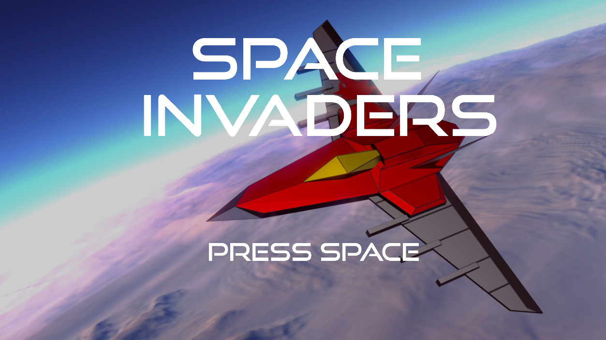
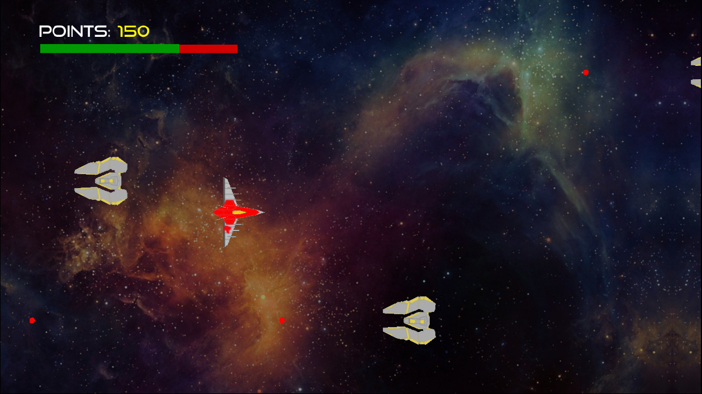
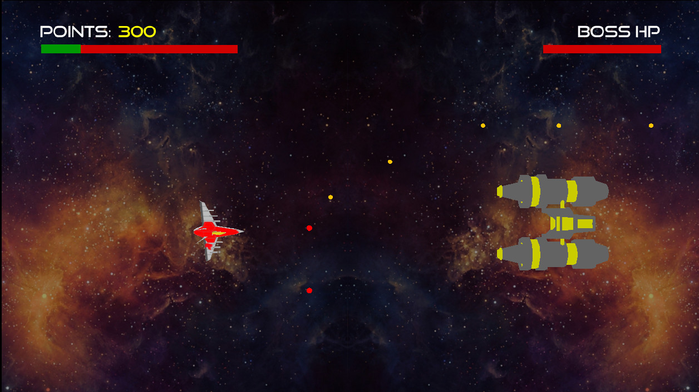
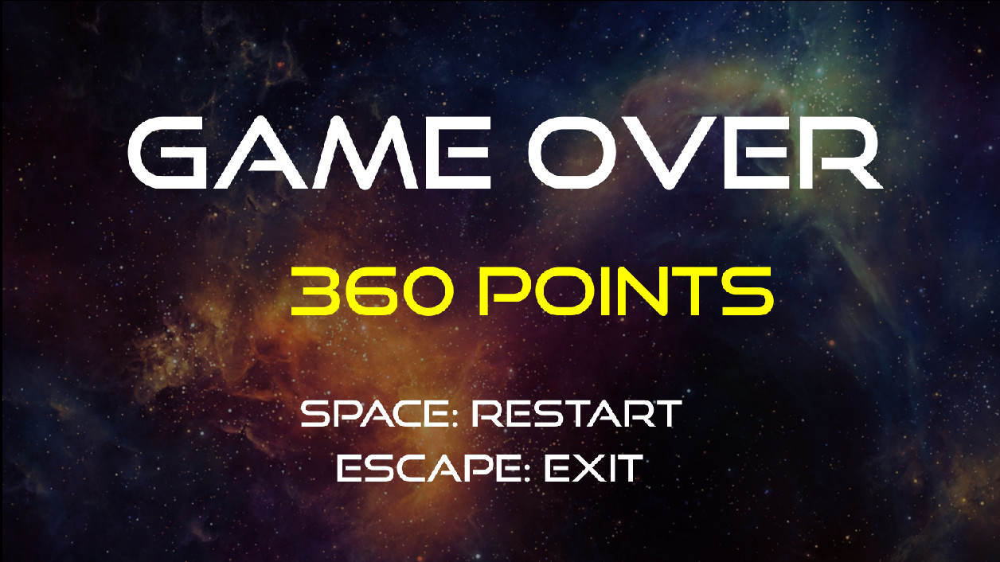

# Spaceships game made with the Blender Game Engine

Endless game in which you drive a spaceship that must destroy as many enemies as possible before being defeated. Each time the player gets 300 points, a boss will appear. _Can you destroy'em all?_

You can download it for free on the [releases](https://github.com/gomezportillo/bge_space_invaders/releases) tab or read the [PDF documentation](doc/doc.pdf).

## Showcase video

Click on the image to watch the video demo.

## Screenshots

### Splash screen

### Main menu

### Gameplay

### Boss battle

### Game over

